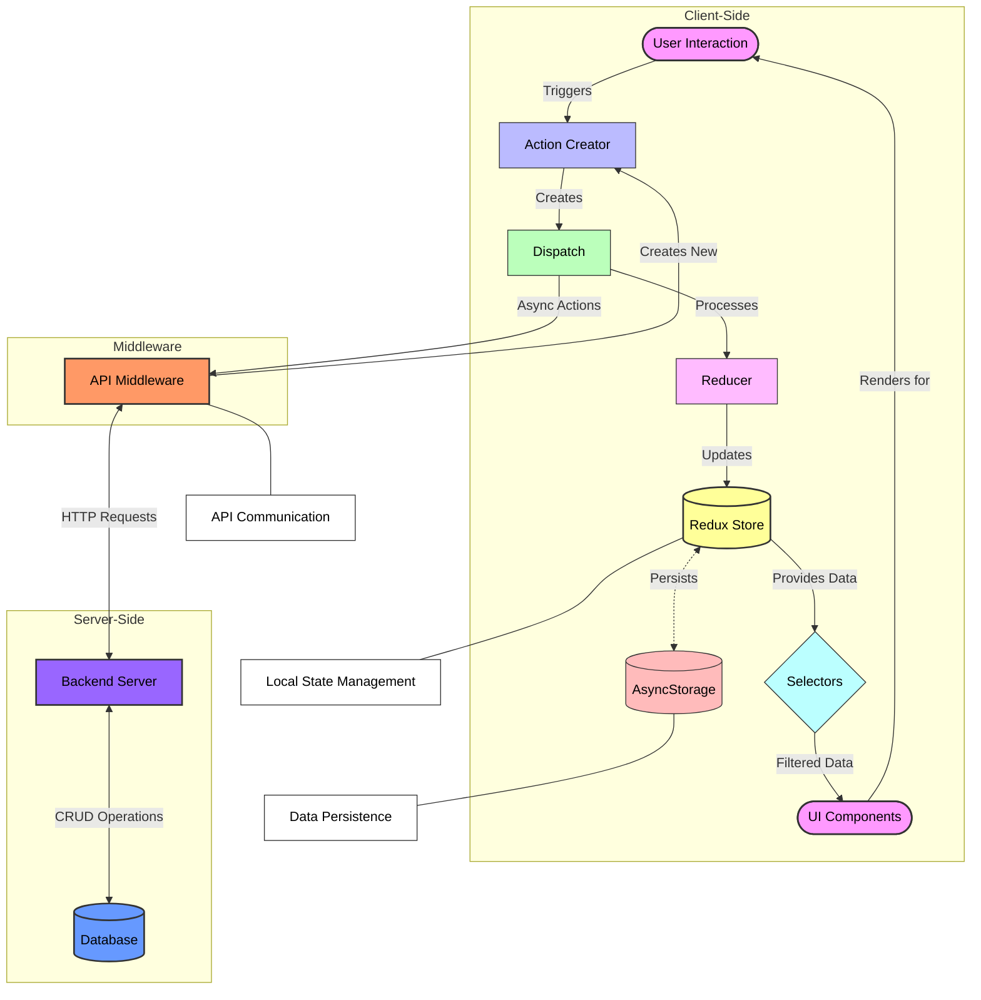

```mermaid
graph TD
    %% Client-side components
    subgraph Client[Client-Side]
        User([User Interaction])
        style User fill:#f9f,stroke:#333,stroke-width:2px,color:black

        Action[Action Creator]
        style Action fill:#bbf,stroke:#333,stroke-width:1px,color:black

        Dispatch[Dispatch]
        style Dispatch fill:#bfb,stroke:#333,stroke-width:1px,color:black

        Reducer[Reducer]
        style Reducer fill:#fbf,stroke:#333,stroke-width:1px,color:black

        Store[(Redux Store)]
        style Store fill:#ff9,stroke:#333,stroke-width:2px,color:black

        Selectors{Selectors}
        style Selectors fill:#bff,stroke:#333,stroke-width:1px,color:black

        UI([UI Components])
        style UI fill:#f9f,stroke:#333,stroke-width:2px,color:black

        AsyncStorage[(AsyncStorage)]
        style AsyncStorage fill:#fbb,stroke:#333,stroke-width:1px,color:black
    end

    %% Middleware
    subgraph Middleware
        API[API Middleware]
        style API fill:#f96,stroke:#333,stroke-width:2px,color:black
    end

    %% Server-side components
    subgraph Server[Server-Side]
        Backend[Backend Server]
        style Backend fill:#96f,stroke:#333,stroke-width:2px,color:black

        Database[(Database)]
        style Database fill:#69f,stroke:#333,stroke-width:2px,color:black
    end

    %% Relationships
    User -->|Triggers| Action
    Action -->|Creates| Dispatch
    Dispatch -->|Processes| Reducer
    Reducer -->|Updates| Store
    Store -->|Provides Data| Selectors
    Selectors -->|Filtered Data| UI
    UI -->|Renders for| User

    Store <-.->|Persists| AsyncStorage

    Dispatch -->|Async Actions| API
    API <--->|HTTP Requests| Backend
    Backend <--->|CRUD Operations| Database
    API -->|Creates New| Action

    %% Add some clarifying notes
    classDef note fill:#fff,stroke:#333,stroke-width:1px,color:black;
    note1[Local State Management]
    note2[API Communication]
    note3[Data Persistence]

    class note1,note2,note3 note;

    Store --- note1
    API --- note2
    AsyncStorage --- note3
```
