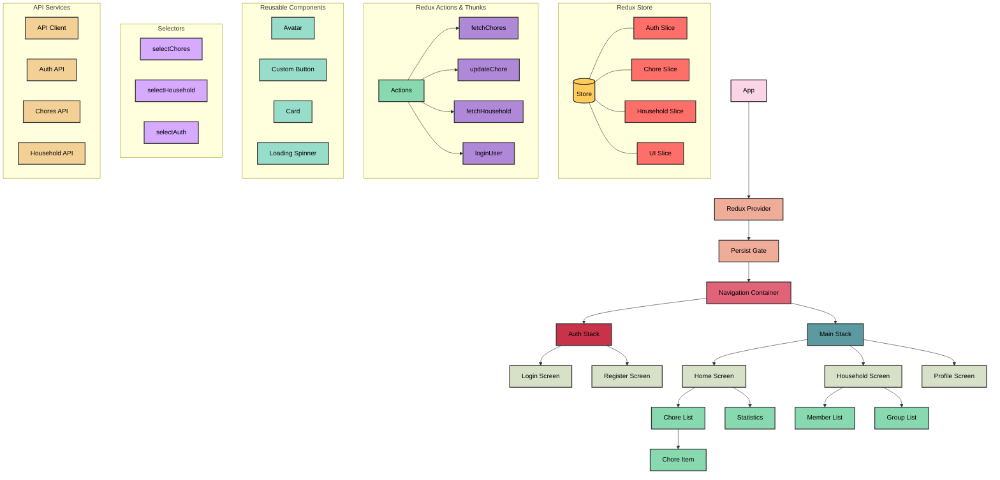

```mermaid
graph TD
    App:::appStyle --> Provider[Redux Provider]:::reduxStyle
    Provider --> PersistGate[Persist Gate]:::reduxStyle
    PersistGate --> NavContainer[Navigation Container]:::navStyle

    NavContainer --> AuthStack[Auth Stack]:::authStyle
    NavContainer --> MainStack[Main Stack]:::mainStyle

    AuthStack --> LoginScreen[Login Screen]:::screenStyle
    AuthStack --> RegisterScreen[Register Screen]:::screenStyle

    MainStack --> HomeScreen[Home Screen]:::screenStyle
    MainStack --> HouseholdScreen[Household Screen]:::screenStyle
    MainStack --> ProfileScreen[Profile Screen]:::screenStyle

    HomeScreen --> ChoreList[Chore List]:::componentStyle
    HomeScreen --> Statistics[Statistics]:::componentStyle

    ChoreList --> ChoreItem[Chore Item]:::componentStyle

    HouseholdScreen --> MemberList[Member List]:::componentStyle
    HouseholdScreen --> GroupList[Group List]:::componentStyle

    subgraph "Redux Store"
        Store[(Store)]:::storeStyle
        Store --- AuthSlice[Auth Slice]:::sliceStyle
        Store --- ChoreSlice[Chore Slice]:::sliceStyle
        Store --- HouseholdSlice[Household Slice]:::sliceStyle
        Store --- UISlice[UI Slice]:::sliceStyle
    end

    subgraph "Redux Actions & Thunks"
        Actions[Actions]:::actionStyle
        Actions --> FetchChores[fetchChores]:::thunkStyle
        Actions --> UpdateChore[updateChore]:::thunkStyle
        Actions --> FetchHousehold[fetchHousehold]:::thunkStyle
        Actions --> LoginAction[loginUser]:::thunkStyle
    end

    subgraph "Reusable Components"
        direction LR
        Avatar[Avatar]:::reusableStyle
        Button[Custom Button]:::reusableStyle
        Card[Card]:::reusableStyle
        LoadingSpinner[Loading Spinner]:::reusableStyle
    end

    subgraph "Selectors"
        direction LR
        SelectChores[selectChores]:::selectorStyle
        SelectHousehold[selectHousehold]:::selectorStyle
        SelectAuth[selectAuth]:::selectorStyle
    end

    subgraph "API Services"
        direction LR
        API[API Client]:::apiStyle
        AuthAPI[Auth API]:::apiStyle
        ChoresAPI[Chores API]:::apiStyle
        HouseholdAPI[Household API]:::apiStyle
    end

    classDef appStyle fill:#f9d5e5,stroke:#333,stroke-width:2px,color:black;
    classDef reduxStyle fill:#eeac99,stroke:#333,stroke-width:2px,color:black;
    classDef navStyle fill:#e06377,stroke:#333,stroke-width:2px,color:black;
    classDef authStyle fill:#c83349,stroke:#333,stroke-width:2px,color:black;
    classDef mainStyle fill:#5b9aa0,stroke:#333,stroke-width:2px,color:black;
    classDef screenStyle fill:#d6e1c7,stroke:#333,stroke-width:2px,color:black;
    classDef componentStyle fill:#88d8b0,stroke:#333,stroke-width:2px,color:black;
    classDef storeStyle fill:#ffcc5c,stroke:#333,stroke-width:2px,color:black;
    classDef sliceStyle fill:#ff6f69,stroke:#333,stroke-width:2px,color:black;
    classDef actionStyle fill:#88d8b0,stroke:#333,stroke-width:2px,color:black;
    classDef thunkStyle fill:#b088d8,stroke:#333,stroke-width:2px,color:black;
    classDef reusableStyle fill:#98ddca,stroke:#333,stroke-width:2px,color:black;
    classDef selectorStyle fill:#d5aaff,stroke:#333,stroke-width:2px,color:black;
    classDef apiStyle fill:#f2d096,stroke:#333,stroke-width:2px,color:black;
```
