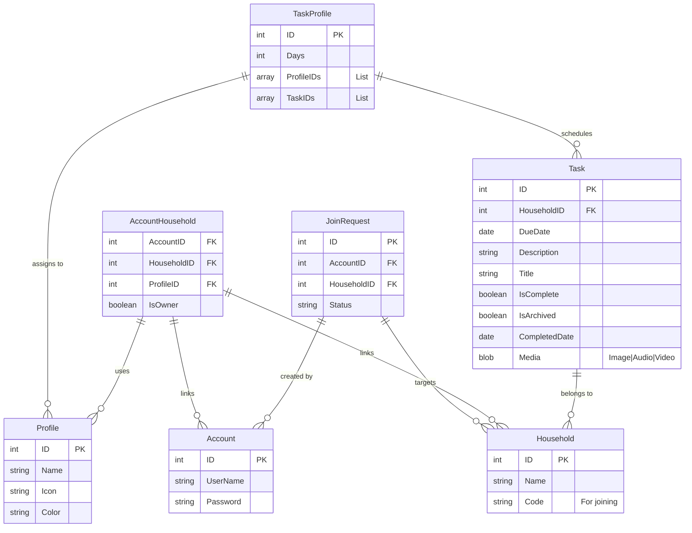

```mermaid
erDiagram
    Task ||--o{ Household : "belongs to"
    AccountHousehold ||--o{ Household : "links"
    JoinRequest ||--o{ Household : "targets"
    JoinRequest ||--o{ Account : "created by"
    AccountHousehold ||--o{ Account : "links"
    AccountHousehold ||--o{ Profile : "uses"
    TaskProfile ||--o{ Profile : "assigns to"
    TaskProfile ||--o{ Task : "schedules"

    Task {
        int ID PK
        int HouseholdID FK
        date DueDate
        string Description
        string Title
        boolean IsComplete
        boolean IsArchived
        date CompletedDate
        blob Media "Image|Audio|Video"
    }

    Household {
        int ID PK
        string Name
        string Code "For joining"
    }

    Account {
        int ID PK
        string UserName
        string Password
    }

    Profile {
        int ID PK
        string Name
        string Icon
        string Color
    }

    JoinRequest {
        int ID PK
        int AccountID FK
        int HouseholdID FK
        string Status
    }

    AccountHousehold {
        int AccountID FK
        int HouseholdID FK
        int ProfileID FK
        boolean IsOwner
    }

    TaskProfile {
        int ID PK
        int Days
        array ProfileIDs "List<ProfileID>"
        array TaskIDs "List<TaskID>"
    }
```
